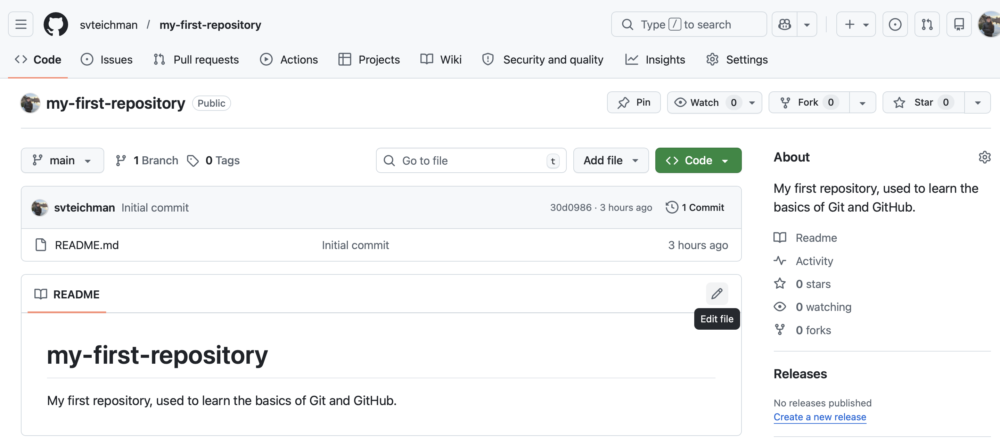

<!--
Introduction to Git and GitHub (similar to "Dashboard Basics" section in school shootings OCS)
-->

# **Introduction to Git and GitHub**
***

Before we start to address your project with Collab O. Rator, we will provide an introduction to version control with Git and GitHub. In this section, you will learn more about what Git and GitHub are, create a GitHub account, download Git software, and create your first version controlled project. In the next section we will return to the infant microbiome meta-analysis project. 

## What is version control? 

We will refer to two papers about version control. 

:::{.reference_box}
::::{.reference_box_header}
Version control resources:
::::
::::{.inner_block}
- Blischak, J. D., Davenport, E. R., & Wilson, G (2016). [A Quick Introduction to Version Control with Git and GitHub](https://doi.org/10.1371/journal.pcbi.1004668), PLoS Computational Biology, 12(1).  
- Bryan, J (2018). [Excuse Me, Do You Have a Moment to Talk About Version Control?](https://doi.org/10.7287/peerj.preprints.3159v2) The American Statistician, 72(1), 20-27. 
::::
:::

Consider a typical workflow when you have a project with multiple files (for example: data, code, resulting figures). You likely have a folder on your computer where you keep these files. When you edit a file you save it, and you have access to the most recent version. You might run into a situation where you want to try something new, so you save "project_file_old.R" along with "project_file_updated.R" or perhaps "project_file_july_2026.R" or eventually "project_file_final_version_4_final.R". If you haven't saved an older version of a file but you wish you could revert to the version from last week before you tried something new, you would be out of luck. 

[Image of what this might look like]

Similarly, think about how you might work on that same project with a collaborator. Perhaps you both have a folder on your computer for that project, and when you make an update you email the file to your collaborator, and they copy that update into their file, or save your file in their folder. Perhaps the two of you update the same file at the same time and then you have to go through line by line to merge the updates into a single version of the file. 

[Image of what this might look like]

While both of these organizational systems can work well when carefully maintained, they are time consuming and prone to error. Version control is a tool that makes it easier to manage sets of files for projects. It automates several of the processes described above, and makes others dramatically easier. While version control was originally made for software engineers to work together on large projects, it is now commonly used for scientific projects as well.

At its core, version control lets the user track sequential changes to a set of files, with a short message attached to each version. Multiple people can work with the same version controlled folder, and different versions of files can automatically be merged, unless they are directly in conflict. 

## What are Git and GitHub? 

Git is a version control tool, and GitHub is an website for hosting folders that are tracked with Git. Git works locally on your computer to record different versions of a project, and GitHub works online to provide a digital backup of files, let you connect with collaborators, and optionally create a web presence for your project. 

```{r, fig.alt="Git vs GitHub", out.width = "100%", echo = FALSE}
ottrpal::include_slide("https://docs.google.com/presentation/d/1TEi1D35oiiC21mYR0cKjWuOOpuxm3fTGyCXSqFmjL3I/edit?slide=id.g3d9461be06f_0_114#slide=id.g3d9461be06f_0_114")
```

### Git

The files that are tracked as part of a version controlled project are contained in a repository. 

:::{.definition_box}
::::{.definition_box_header}
Repository (or repo for short)
::::
::::{.inner_block}
A folder in Git that contains all of the files to be tracked for a project.
::::
:::

When you set up a repository, Git will save an initial version of that repository. Git works by tracking the evolution of a repository through a series of commits. 

:::{.definition_box}
::::{.definition_box_header}
Commit
::::
::::{.inner_block}
A snapshot of a repository at a certain time.
::::
:::

Each time that you tell Git to commit a version of your project, it will save it as a series of changes that list the differences between the most recent commit and the current commit. Git will not automatically make commits for you. You need to decide when to commit. When you want to return to a previous version of a project, you can only return to the version of files at any commit.

```{r, fig.alt="Git vs GitHub", out.width = "100%", echo = FALSE}
ottrpal::include_slide("https://docs.google.com/presentation/d/1TEi1D35oiiC21mYR0cKjWuOOpuxm3fTGyCXSqFmjL3I/edit?slide=id.g3d9461be06f_0_143#slide=id.g3d9461be06f_0_143")
```

### GitHub

While you could only use Git locally to track versions of files, it is much more powerful when combined with GitHub. You can use GitHub to host a Git-tracked repository online. We will use the terms local repository and remote repository to distinguish between these. 

:::{.definition_box}
::::{.definition_box_header}
Local
::::
::::{.inner_block}
The Git-tracked repository on your computer. 
::::
:::

:::{.definition_box}
::::{.definition_box_header}
Remote
::::
::::{.inner_block}
The online version of the repository tracked on GitHub. 
::::
:::

There are several benefits to pairing your local repositories with remote repositories on GitHub. 

- You have a backup of files in case something happens to your computer
- You can easily work with collaborators
- You have a central location where your data and code are stored for a project that can be viewed by and shared with other scientists

### Creating new repositories

There are two ways to start new version controlled projects with Git and GitHub. You could create a new repository locally on your computer, track it with Git, and then "push" it to GitHub, creating a remote version of the repo. Or, you could create a new remote repository on GitHub and then "clone" it to your computer, creating a local version. We will provide examples of both workflows in the next section. 

```{r, fig.alt="Git vs GitHub", out.width = "100%", echo = FALSE}
ottrpal::include_slide("https://docs.google.com/presentation/d/1TEi1D35oiiC21mYR0cKjWuOOpuxm3fTGyCXSqFmjL3I/edit?slide=id.g3d9461be06f_0_210#slide=id.g3d9461be06f_0_210")
```

## Getting started with Git and GitHub

### Creating a GitHub account

We will start with GitHub. If you do not have an account, make one [here](https://www.google.com/url?sa=t&source=web&rct=j&opi=89978449&url=https://github.com/signup&ved=2ahUKEwjRoqKR48-TAxVIyOYEHYMpA6QQFnoECA0QAQ&usg=AOvVaw0a6qEmIZVdziwPUb-hFApr). 

When you choose a username, consider [advice](https://happygitwithr.com/github-acct) from Jenny Bryan (a data scientist who has thought a lot about version control). She suggests choosing a username that incorporates your real name and that you would be comfortable sharing with professional colleagues. 

### Creating a new GitHub repository

Now that you have a GitHub account, you can create your first repository. 

To create your repository, click on the menu bottom (three horizontal lines), and click "Repositories." Then click the green button that says "New repository." 

This will take you to a new page. GitHub will automatically set you as the owner of the repository, and you can choose a name. Let's call this repository "my-first-repository". 

A few notes on naming repositories:

* keep the name descriptive but short
* don't use spaces, instead use "-", "_", or "." 

Add a short description for this repository. 

Next, under configuration, we have several options. By default repositories will be public, but you can set them as private and add collaborators who can access them. Toggle the bottom next to "Add README" to "On". For now, we won't worry about a template, .gitignore, or license. 

```{r, fig.alt="Creating first repository", out.width = "100%", echo = FALSE}
ottrpal::include_slide("https://docs.google.com/presentation/d/1TEi1D35oiiC21mYR0cKjWuOOpuxm3fTGyCXSqFmjL3I/edit?slide=id.g3e1f8f72664_0_798#slide=id.g3e1f8f72664_0_798")
```
Let's break down each of the options in the "Configuration" settings here. 

***

<details> <summary> Visibility </summary>

By default your repository will be set to public, which means that anyone can view all of the files contained in it. If you would prefer that only you and collaborators that you add can view the contents, you can set the visibility to private. 

</details>

<details> <summary> Template </summary>

A template is an existing repository that you can use as a template for new repositories. A repository made from this template will have the same folders and files as the template repository. You can make any repository that you have access to into a template. Typically, you will not use a template when creating a new repository. 

</details>

<details> <summary> README </summary>

We will discuss README files in more detail in the project organization section, but a README file explains what your repository is used for and what files it contains. If you are creating a repository from scratch, we strongly suggest that you include a README. 

</details>

<details> <summary> .gitignore </summary>

Often when you commit files you will commit all files in your repository. However, you may have files that you don't want to commit, such as large data files or intermediate files (we will discuss which files you may not want to commit later in the project organization section). If there is a file that you don't want to track with version control, you can add it to the .gitignore file, to tell Git to ignore it. When you click the down arrow next to "No .gitignore" it will provide several templates. For a project using R, the "R" template is a good place to start. It includes files often associated with projects in R that are not typically tracked with version control.

</details>

<details> <summary> License </summary>

A license is a legal document that states who can use your code. Although it may seem counterintuitive, a license typically makes your code more "open", which means that other people can use it with fewer restrictions. There are two main types of licenses used for most R projects hosted on GitHub: permissive (MIT) and copyleft (GPL). A permissive license means that people can use your code with minimal restrictions. A copyleft license means that any code that incorporates your code must also be open-source. [Need to add more info here as well as citations!]

</details>

***

Once you click "Create repository", you will be brought to the GitHub page for your repository. GitHub URLs all have the same format: "https://github.com/your_user_name/your_repository_name".

If you look at your repository, you will see that it has one file, README.md. This is where you will document what is contained in your repository, and it will serve as a homepage for your project. It is written in Markdown language [add some information about markdown]. Click the pencil on the upper right of the README, and add a new line to your README document. 

{fig-alt="Edit README from GitHub" width=800 .lightbox}
Once you add in your new line, click the green button that says "Commit changes" and provide an informative commit message (something like "adding new line to README"). Then click the repository name in the upper left to navigate back to the home page. 

Let's now look at the commit history for this repository. We can do that by clicking where it says "2 Commits" just below the green "Code" button. 

[More discussion on commits and what we're seeing in terms of diff].

### Installing GitHub Desktop 

Next, we will install GitHub Desktop. This is a GUI (graphical user interface) that makes it easier for us to interact with Git. While we will use GitHub Desktop in this case study, another common way to interact with Git is through the command line on your computer. If you are already comfortable using the command line, you may prefer this to GitHub Desktop. When we use GitHub Desktop for version control tasks in this case study, we will also provide the command line code for all Git operations.

<details> <summary> More information about the command line. </summary>

You may have also heard this called the *shell*, *terminal*, *console*, or *command prompt*. The command line interface lets us interact with our computers by typing commands (as opposed to using a graphical interface which involves clicking buttons and menus). These commands let you perform tasks such as navigating and modifying your file system, installing programs, running code, and working with Git. Each of these tasks can also be performed using a graphical interface. Some people prefer the visual layout of a GUI, while others prefer the simplicity and centralized control of the command line. 

</details>

Follow this [link](https://desktop.github.com/download/) to install GitHub Desktop. 

<details> <summary> If you are using a Mac, it will ask you if your Mac has a Apple silicon or Intel chip. Click here for more information. </summary>

To check whether your Mac has an Apple silicon chip or an Intel chip, click the Apple menu -> "About This Mac". If the information window shows "Chip" then your Mac uses Apple silicon. If the information window shows "Processor" then your Mac uses an Intel processor. 

</details>

### Installing Git

If you have successfully installed GitHub Desktop, then Git is already installed on your system and no further installation is required. 

<details> <summary> If you are unable to install GitHub Desktop or would prefer not to install GitHub Desktop, you can install Git using the command line. Click here for more information. </summary>

First, we will see if Git is installed on your computer, and install it if not. We will start by opening the command line. 

::: {.panel-tabset}
#### Mac

Open the application called "Terminal". You can find this by using Spotlight Search and searching for "Terminal". 

#### Windows

Open the application called "Command Prompt". You can find this by using the Start menu and searching for "Command Prompt". You could instead use the PowerShell by searching for "PowerShell" instead. 

#### Linux 

Open the application called "Terminal". You can find it by using your system’s application menu and searching for "Terminal".

:::

In the command line, type:

```{.cmd-box}
git version
```

If the output tells you which version of Git is installed, then you already have Git. For example, it may look like:

```{.cmd-box}
git version 2.50.1
```

If you see a message like "git: command not found" or "git is not recognized" or a prompt to install something, then Git is not installed and you'll need to install it. 

To install Git, follow these instructions:

::: {.panel-tabset}
#### Mac

Follow [these instructions](https://github.com/git-guides/install-git#install-git-on-mac).

#### Windows

Follow [these instructions](https://github.com/git-guides/install-git#install-git-on-windows).

#### Linux 

Follow [these instructions](https://github.com/git-guides/install-git#install-git-on-linux).

:::

</details>

### Connecting Git to GitHub

If you have GitHub Desktop installed, we can use it to authenticate your GitHub account with Git. We could also do this with the command line, but GitHub Desktop makes it easier. 

::: {.panel-tabset}

#### GitHub Desktop 

When you open GitHub Desktop, it will prompt you to sign into GitHub. If it does not, then follow [these instructions](https://docs.github.com/en/desktop/installing-and-authenticating-to-github-desktop/authenticating-to-github-in-github-desktop), choosing instructions for Mac or Windows based on your operating system.

Next, we will configure Git. This means that you will tell Git your name and email. Follow [these instructions](https://docs.github.com/en/desktop/configuring-and-customizing-github-desktop/configuring-git-for-github-desktop), again choosing instructions for Mac or Windows based on your operating system. 

#### Command line 

First we will tell Git your name and email address. Open the command line and enter the following:

```{.cmd-box}
git config --global user.name "Your name here"
git config --global user.email "Your email here"
git config --global --list
```

The third line should print your name and email correctly.

Next, you need to connect your GitHub account to your local Git. 

GitHub no longer supports using passwords to connect Git and GitHub, so you'll instead need to use a Personal Access Token (PAT). To create a token, [follow these instructions](https://github.com/settings/tokens). Click "Generate new token" and choose "Generate new token (classic)". Give your token a name and expiration date. Select the "repo" scope. Click "Generate Token". Copy the token to your clipboard, or keep this window open. You will not be able to access this again. 

Now, open the command line and run the following:

::: {.panel-tabset}

#### Mac

```{.cmd-box}
git config --global credential.helper osxkeychain
```

#### Windows

```{.cmd-box}
git config --global credential.helper manager
```

#### Linux 

If available, run:

```{.cmd-box}
git config --global credential.helper manager
```

If that does not work, use: 

```{.cmd-box}
git config --global credential.helper cache
```

:::

This tells Git to remember the login credentials that we will provide so you won't need to enter them each time. 

Next, we need to trigger a GitHub credentials check. We will do this by cloning the repository that you made (this means we will make a local version of this repo). Run the following, replacing "your_username" with your username:

```{.cmd-box}
git clone https://github.com/your_username/my-first-repository.git  
```

Running this command should prompt you to give a username and password. Use your GitHub username, and the PAT you just generated as the password (do not use your GitHub password). Git will now store these credentials so you won't need to enter them again. When your PAT expires, you will need to follow these steps again. 

:::

### Creating a local clone of your GitHub repository 

You've finished setting up GitHub, Git, and GitHub Desktop, great job! Now, we can get a local version of your repository that you made on GitHub earlier. 

Making a local copy of a repository that is hosted on GitHub is called "cloning". We will clone the repository using GitHub Desktop. To do this, go to "File -> Clone Repository" and then provide the URL to your GitHub repository. 

[add image]

Now, you should be able to see a window in GitHub Desktop that corresponds with "my-first-repository". If you click on history, you can see a list of commits to this repository. 

[Make separate small section on RStudio projects, what they are and how they can be used along with GitHub repositories]

We will now open up our repository in RStudio. This will require one additional step. Open RStudio, and click "File -> New Project." Then click "Existing directory", and click "Browse" to find the folder labeled "my-first-repository". Then click "Create Project". An RStudio project is similar to a repository, it is a folder that R can open as a self-contained unit. It includes a file with the extension ".Rproj", and when you open this file it will open RStudio to this project folder. 

Now, you'll see that you are in RStudio, in a folder that corresponds to your "my-first-repository" repo. Click on the "README.md" file in the "Files" panel, which will open the README that you made on GitHub. Add a new line to the README and save the file. 

Now, navigate back to GitHub Desktop. Where it previously said "no local changes", it now will show changes to your repository. This will include two added files (".gitignore" and "my-first-repository.Rproj"), and modifications to "README.md". You can see that new files have a green box with a plus next to them, and modified files have a yellow box with a circle next to them. 

By default, the box next to each of these files is checked. This means that each of these files are "staged", or ready to be included in a commit and added to the repository history. If you uncheck the box, you are telling Git that for now you would not like to track that file with version control. 

In the lower left corner you will see a box that says "Summary (required)" and "Description". This is where you will put your commit message. 

[add image]

A quick note on commit messages (discuss how these should be informative to you in a few months or to a collaborate. They will live forever on GitHub, so make sure they are appropriate). 

For this commit, you might use the summary "Adding .gitignore and .Rproj files, adding a line to README.md." 

Once you've added the commit message, you are ready to commit these files. Click "commit to main". Now these changes have been entered into the version control history of your repository in Git. 

We have one more step to update the GitHub repository, which is to "push" these files to GitHub. This will be provided in a blue box on GitHub Desktop which says "Push commits to the origin remote". Now, open your project in GitHub. You should now see the updated files including changes that you made locally, as well the commit message. 

On GitHub, we will use the online interface to add one more line to the README. Add whatever you want, and commit that change. Now, return to GitHub Desktop. In the upper banner, click where it says "Fetch origin". It should then update and say "Pull origin". Click "Pull origin". Go to the "History" pane, and you'll see the most recent commit that you made on GitHub, now included in your local repository. If you return to RStudio and open "README.md", you will now see the update that you made on GitHub. 

### What you've done

In this section you have made a GitHub account, installed Git and GitHub Desktop, configured Git and GitHub to talk to each other, and made your first repository. You've learned how to make changes to the remote, from GitHub, and transfer them to your local repository on your computer, as well as do the opposite. In a typical GitHub workflow, you will rarely be making changes from GitHub. Instead, you will often be working with one or multiple collaborators on a repository. Once your collaborator makes changes locally, they can push those changes to GitHub, and then you can pull those changes to your local copy of the repository. 

[Add image to show a summary of the clone/stage/commit/push workflow]

### Tips

- Commit often. A history will not be helpful if you run an entire analysis locally and then commit everything in a single commit. 
- Write commit messages concisely explaining what you did to a collaborator now or to yourself in three months
- If you are working on a repository with multiple contributors, make sure to pull each time you work in order to work on the most up-to-date version of the repository 

## Create version controlled repository for your project 

Now, we will return to the project with Collab. O. Rator. In the previous section, we created a repository on GitHub, and then cloned to make a local copy. Here, we will start with a local folder, track it with Git, and then create a remote version on GitHub. 

First, download the .zip file [here](https://github.com/opencasestudies/mother-infant-gut-microbiome-analysis-sandbox/raw/refs/heads/main/infant_gut_files.zip). Your browser may automatically unzip this file to create a folder called "infant_gut_files", if not then unzip the file. 

Now, go to GitHub Desktop. Click the button "Add" in the top right, and "Create New Repository". Give your repository the name "infant_gut_analysis". Leave the box "Initialize this repository with a README" unchecked (because a README is already included in the set of files). Under Git Ignore choose "R" and under License choose 
"MIT License". 

[discuss what .gitignore files and licenses mean. Question - any good resources for choosing a license for a scientific research project hosted on GitHub?]

Now, copy the contents of the "infant_gut_files" into the new repository that you just created with GitHub Desktop [potentially include drop-down to help find the folders on different operating systems]. 

Once you add these files, return to GitHub Desktop. You should see a set of staged files. Add a commit message and commit this change. You should then see an option to "Publish repository". Once you do this, you should see the option "Open the repository page on GitHub in your browser". Clicking this will bring you to the new GitHub repo that you just made for this project! 

### Open this project in RStudio

Finally, we will create another RStudio project for this GitHub repository, so that we can easily work with these set of files in RStudio. Do this by opening RStudio and clicking "File -> New Project -> Existing Repository" and use "Browse" to find the folder for the repository that you created. This will open your project in R. You will have added a .Rproj file, which we will add to our .gitignore (this means that we'll use it locally but we will not track changes to it with Git or push it to GitHub). Open your .gitignore file and add a new line with the text "infant_gut_analysis.Rproj". 

## Branches

One useful feature of Git is the ability to make branches. A branch is a history of commits, and by default a repository that is tracked by Git starts with the "main" branch. Multiple branches provide multiple parallel versions of the repository that can be developed separately. For example, you may have a version of your analysis and results in the main branch, but you want to experiment with changing a parameter. You could do this in a separate branch. This would let you work on the experimental version of your analysis while also having a stable version of your analysis elsewhere. You can switch between branches depending on what version of the analysis you want to work on. If you eventually decide that you want to move forward with the changed parameter, you can merge your experimental branch back into your main branch. 

:::{.definition_box}
::::{.definition_box_header}
Merge
::::
::::{.inner_block}
Integrating changes from one branch into another branch. 
::::
:::

If there are no lines of code in any files that are directly in conflict, then merging will automatically combine the sets of files into a single version to move forward with. [Mention that we discuss merge conflicts in "Troubleshooting Git and GitHub"]

[Add image of merged versions]

Branches are also helpful when working with collaborators. If you are developing a new part of an analysis, you can do it in a separate branch. When you are ready for your collaborator to review your work, you can submit a "pull request", which is a request to merge your branch with the main branch. Your collaborator can review all of the changes between your branch and the new branch, and either approve the pull request or request edits before merging. [Mention that we describe pull requests in more detail below.]

### Create a new branch for this analysis 

You can create a new branch with GitHub Desktop. In GitHub Desktop, navigate to the tab in the top left of the window that says "Current Branch." Click on this tab, and you should see a button that says "New Branch". Name your new branch "study_comparison". 

***
