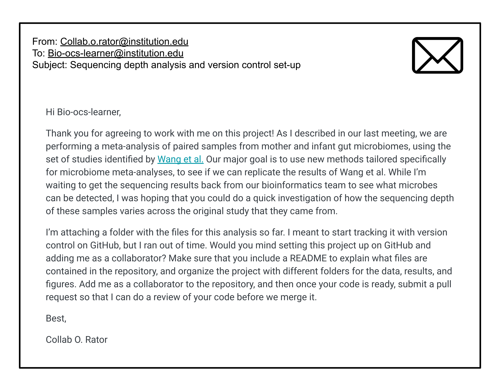

<!--
Describe the biological motivation for this case study.
Include relevant explanatory images and references throughout.
See this previous case study as an example: https://www.opencasestudies.org/ocs-bp-co2-emissions/#Motivation
Images or videos may be helpful so this includes an example of including an image.
-->

# **Motivation**
***

In this case study, we ask you to imagine that you are working with a collaborator on a scientific project. You receive the following email, with a request for your help tracking the project using version control and performing a preliminary data analysis. Don't worry if some of these terms don't make sense right now, each will be explained later on in the case study. 

{fig-alt="Workflow of the different version control steps in this case study" width=800 .lightbox}

In this case study, you will learn how to use Git and GitHub to track this project and perform the requested sequencing depth investigation. Along the way, you will learn how version control can be used to improve reproducibility of a scientific project and how it can make collaboration easier. 

:::{.definition_box}
::::{.definition_box_header}
Reproducibility
::::
::::{.inner_block}
The ability for someone else the run the same analysis on the same data and get the same results.
::::
:::

When conducting a scientific project, reproducibility is very important. Version control is a tool that enables reproducible research by recording changes to a project over time. When used carefully, it gives a complete history of changes made over the course of a project. It also provides a digital backup and an online repository of code and data for other researchers to see. Version control makes collaboration easier, automating the sharing of work in-progress and providing a system to propose and accept changes. While several tools exist for version control, we will introduce Git and GitHub, two of the most commonly used version control tools. 
  

***
