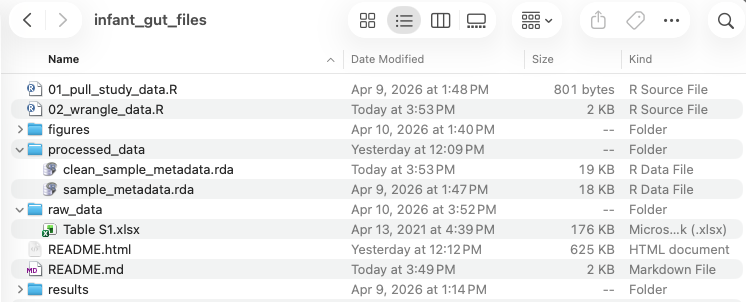

<!--
Project organization (similar to "Dashboard Basics" section in school shootings OCS)
-->

# **Scientific project organization**
***

In this section, discuss the following:

- README: what should be documented in README
- raw data folder
- processed data folder
- scripts, numbered based on the order in which they should be run 
- figures folder
- results folder

## This project

The projects includes these files:

{fig-alt="Files within project folder, shown in Finder window" width=800 .lightbox}

## README

README.md contains the following:

```
## Project information

The goal of this project is to use recent microbiome meta-analysis methods to re-analyze data from Wang et al.

Data citation: Wang, S., Zeng, S., Egan, M., Cherry, P., Strain, C., Morais, E., Boyaval, P., Ryan, C. A., Dempsey, E., Ross, R. P., & Stanton, C. (2021). Metagenomic analysis of mother‑infant gut microbiome reveals global distinct and shared microbial signatures. Gut Microbes, 13(1). https://doi.org/10.1080/19490976.2021.1911571 

## Organization

This repo is organized as follows:

- 01_pull_study_data.R: script to read in data from "raw_data/Table S1.xlsx" and create a single data table in "processed_data/sample_metadata.rda"
- 02_wrangle_data.R: script to wrangle data from "processed_data/sample_metadata.Rda" to fix mistakes, remove invalid observations, and make data easier to work with, creates "processed_data/clean_sample_metadata.Rda"
- raw_data: 
  - Table S1.xlsx: Supplementary information from [Wang et al.](https://www.tandfonline.com/doi/full/10.1080/19490976.2021.1911571?scroll=top&needAccess=true#abstract), included as part of a [.zip file](https://www.tandfonline.com/action/downloadSupplement?doi=10.1080%2F19490976.2021.1911571&file=kgmi_a_1911571_sm8722.zip)
- processed_data: 
  - sample_metadata.rda: table with data about samples from each original study included in the meta-analysis of Wang et al., generated in "01_pull_study_data.R"
  - clean_sample_metadata.rda: table with cleaned data about samples from each original study, generated in "02_wrangle_data.R"
- figures: 
- results: 
```

## Other organization notes

Note that any empty folders may exist on your computer but will not be tracked by Git until they have content. So while we see "figures" and "results" in the set of files from the folder "infant_gut_files", they are not tracked by Git or hosted on GitHub. 

[This could also be a good time to talk about large files, what to track vs not track with GitHub. Connect to .gitignore. Discuss how tracking large files either in terms of data and results can cause problems. Discuss Git LFS vs data repositories like Figshare and Zenodo]

***
