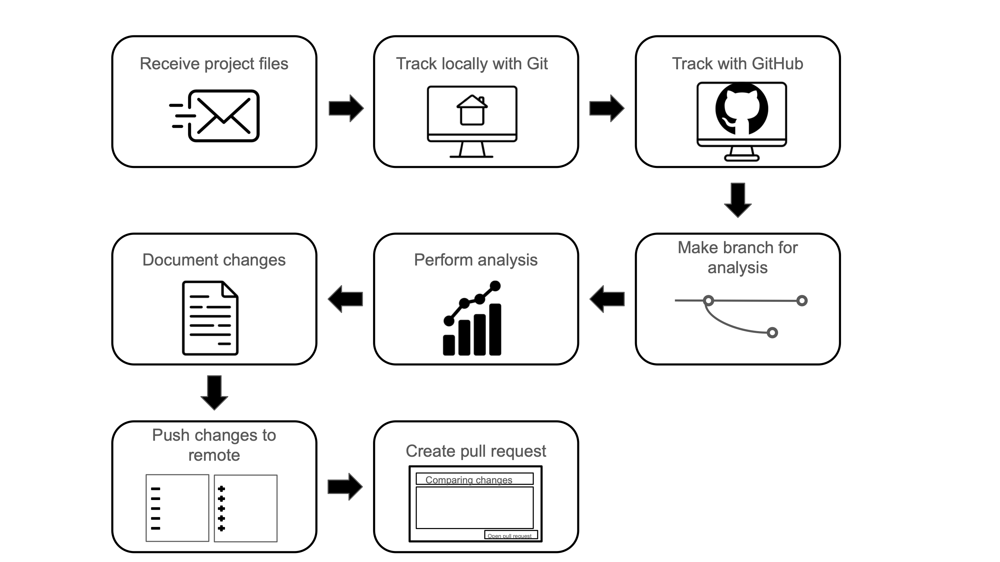

# **Summary**
***
## **Synopsis**
***

In this case study, you've learned about why  is used as part of  science workflows. You've been introduced to  and , and learned procedures for managing Git-tracked  locally using  or the , and remotely using GitHub. You've practiced using the "pull -> stage -> commit -> push" workflow to make changes locally that are then tracked remotely. In your analysis, you worked in a , and you submitted a  in order to integrate new changes into a stable version of the code and as a way to ask a collaborate to review your code. 

Along the way, you've also learned about the advantages and challenges of  and best practices for scientific project organization. 

***

## **Summary Plot**
***

In order to create the final summary plot, please drag and drop the steps that you've followed in this case study into the correct order. 

::: {.column-margin}
to-do: figure out how to make this into a drag and drop activity for the learner (see [this platform](https://lumi.education/en/)))

Note: this is a mock-up of what the figure may look like, but a final version will be a little more detailed and include color and more collaborative elements of the process! 
:::

{fig-alt="Workflow of the different version control steps in this case study" width=800 .lightbox}

<!--
construct a plot here that summarizes the conclusions found in the data, if applicable
(connecting to a main question if possible)
-->

***
